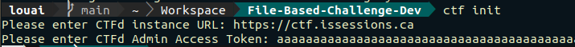
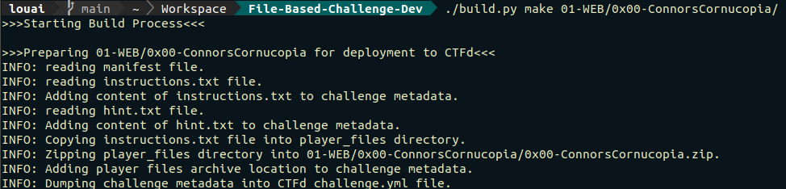

# Challenge Development Process: File-Based Challenges


## Purpose

Challenges must be organized in a standard format in order to:
- Automate deployment to CTFd
- Facilitate the creation of a development -> testing -> production pipeline
- Make it easier to modify challenge state over time and on game day

This repository is strictly for **File-Based Challenges**. Hosted Challenges are maintained in a different repository.

## General Organization

At the root of this git repository, a directory is created for each **Challenge Category**. Each category folder contains a set of challenge folders representing individual challenges. 

For example, you might create a **Category folder** called “01-WEB”. Inside “01-WEB”, you can have a number of **challenge directories** such as “0x00-SQLInjection1” and “0x01-TreeTraversal”. 

Each challenge directory has **two subdirectories**, each of which contains a number of files. 
- **player_files (Optional)**: contains any files the challenge developer wishes to share with the players.
	- Anything like a JSON dump, a binary, etc. 
- **documentation (Required)**: contains the challenge's documentation files including:
	- **manifest.yml (Required)**: contains challenge metadata including challenge name, author, category, point value, flags, dependencies, tags, etc.
	- **instructions.txt (Required)**: contains the challege's instructions or in other words, what students see on CTFd when they click a particular challenge.
	- **hint.txt (Optional)**: contains a hint that can aid the player in solving the challenge. The hint can be free or may have a cost associated with it. The cost is deducted from the team's total points. The hint_cost is not specified in hint.txt, only the hint itself. The hint_cost is specified using the "hint_cost" key in manifest.yml
	- **solution.txt (Required)**: contains a detailed walkthrough of the challenge solution for mentors and/or students. Should contain the flags BUT CTFd will base submissions based on what is in the “flags” keys in manifest.yml.

Here is an example CTF with two categories and two challenges, one in each category:


## Deployment Order

Note the number at the beginning of each category and challenge folder. This number is used to force deployment scripts to deploy challenges in a specific order. 

This is important because CTFd requires a challenge to be present before another challenge marks it as a dependency. For example, SQLInjection2 cannot refer to SQLInjection1 as dependency until SQLInjection1 is has been deployed to CTFd.   

## Challenge Documentation

### The `manifest.yml` File
A challenge’s point value can be static or dynamic (based on the # of solves). They can have multiple flags (case-sensitive and case-insensitive). They can have associated tags that perhaps indicate the challenge’s difficulty level, a particular theme, or a useful tool that may aid in solving the challenge. Challenges can also have a cap of the number of attempts. 

Here are a couple of common examples of a manifest.yml file, one for a static challenge and another for a dynamic challenge:

**Example Standard Challenge (Non-Dynamic)**
```
#######################################
# CTFd Parameters
#######################################

challenge:
  # challenge name as it should appear to the players - required
  name: "0x00: CoC"

  # challenge author - required
  author: Louai Abboud

  # challenge category as it should appear to the players - required
  category: Welcome to ISSessionsCTF

  # challenge value
  value: 100

  # all viable solutions to a challenge (i.e. what the student 
  # enters in CTFd) - in depth explanations of the solution 
  # should be placed in documentation/solution.txt. Flags are 
  # case-sensitive but can be made case-insensitive through 
  # the CTFd GUI.
  flags:                             
    - "IAccept"

  # helpful tags to focus the player's attention
  tags:                               
    - beginner

  # standard or dynamic
  type: standard

  # hidden or visible - better to keep hidden by default
  state: hidden

  # challenge version
  version: 1.0  
```

**Example Dynamic Challenge**
```
#####################################
# CTFd PARAMETERS
#####################################
challenge:
  # challenge name as it should appear to the players - required - 20 characters max
  name: "0x00: Connor's Cornucopia"

  # challenge author - required
  author: Louai Abboud

  # challenge category as it should appear to the players - required - 20 characters max
  category: WEB

  # standard or dynamic
  type: dynamic

  # initial challenge value
  value: 100

  # This is the lowest that the challenge can be worth
  minimum: 50

  # The amount of solves before the challenge reaches its minimum value
  decay: 30

  # hint_cost if a hint is provided for the challenge - if not remove key
  hint_cost: 0

  # All viable solutions to a challenge (i.e. what the student enters in 
  # CTFd) - in depth explanations of the solution should be placed in 
  # documentation/solution.txt. Flags are case-sensitive but can be 
  # made case-insensitive through the CTFd GUI.
  flags:                              
    - KylesKonundrum
    - MinhsMuscles
    - JacksJukebox

  # helpful tags to focus the player's attention
  tags:               
    - difficult

  # hidden or visible - better to keep hidden by default
  state: hidden

  # challenge version
  version: 1.0

  # dependencies on other challenges - dependencies must be deployed before current challenge.
  # requirements:                       
  #  - '0x00: CoC'

  # Number of attempts - 0 attempts = infinite attempts
  attempts: 0
```

### The `instructions.txt` File
Use the following guidelines when creating the instructions.txt file. Make sure to include the following items.
- How does the player connect to the challenge (url, ip, port, etc.)? Or do they download a zip file?
- What do you want the player to do?
- Are there any steps to convert the challenge solution to a standardized flag format?

### The `hint.txt` File
Provide a helpful hint here. Hints can be free or paid. If paid, the hint is deducted from the team’s score. The hint_cost key in manifest.yml specifies the cost of the hint.

### The `solution.txt` File
Provide an in-depth explanation of the challenge! Mentors will refer to this solution when helping students during the CTF.

A in-depth explanation should include:
- Recommended tools and resources.
- Setup steps that the players need to go through.
- A detailed step by step solution including rationale, explanations, and specific commands.
- All possible challenge flags.
- Steps to convert the challenge solution to a standard flag format.

## Development Process

### Setup
1. **Create a dedicated challenge development VM.** You will have to install some tools and it’s better not to install them on your personal machine. A **Ubuntu Linux VM** is strongly recommended.
2. Clone `https://github.com/csivitu/ctfcli/`, change directories into the repository’s root, and run the setup.py script to install `ctfcli`. ctfcli allows for the automated deployment of CTF challenges to CTFd from the commandline and is key to automated deployment.

Command:
```
git clone https://github.com/csivitu/ctfcli/ && cd ctfcli && sudo python3 setup.py install --record files.txt
```

3. Add an SSH key to your github account. Here’s a guide: https://docs.github.com/en/github/authenticating-to-github/adding-a-new-ssh-key-to-your-github-account 
4. Get a CTFd access token.
	1. Create an admin account on CTFd.
	2. Click **Settings**
	3. Click **Access Tokens**
	4. Click **Generate** and note down the resulting access token. 
5. On your VM, run the following command. You will get two prompts, one for **CTFd’s URL** and another for your **personal admin access token to CTFd**. Enter these and press Enter. This will create a **.ctf/config** file in the repository.
```
ctf init
```



6. Next, clone this repository.
```
git clone <repo url>
```
7. Create your own branch. You can name it after yourself for example.
```
git branch louai
git checkout louai
```

From now on, use this branch for all challenge development activities. It will be merged into main at a later date.

**Important Note:** 
We are using **a fork of the original ctfd/ctfcli** because the original does not yet support dynamic challenges. In the future, this may:
1. Become unnecessary as the original CTFd ctfcli (https://github.com/CTFd/ctfcli ) implements support for dynamic challenges. This would be great!
2. The fork may break because CTFd has implemented a change at odds with the forked implementation. In this case, you may have to modify ctfcli yourself to support dynamic challenges. (Don’t worry it’s not that complicated of a tool).

### Development

1. Build the file-based challenge. There are plenty of examples online for inspiration:
	1. https://github.com/ctfs (Awesome Resource! Mega Writeup Repo)
	2. https://github.com/infosec-ucalgary/magpieCTF-2021
	3. https://github.com/PlatyPew/picoctf-2018-writeup 
	4. https://github.com/csivitu/ctf-challenges 
2. Organize your challenge in accordance with the directory structure described in the **General Organization** section.
3. Go back to the root of the file-based challenges repository and run the **build.py** script against your challenge directory with the `make` flag. For example:
```
./build.py make 01-WEB/0x00-ConnorsCornucopia/
```
8. Check if build.py produced any errors. The output should look like this:



9. If there are no errors, you are ready to deploy the challenge to CTFd. Note this does not mean the challenge’s logic is sound, only that it builds correctly. Challenge logic will be verified in the testing phase. 

**What did build.py do?**

You will notice that two files have been created in each challenge directory:
1. **challenge.yml**: this is CTFd standard deployment file. We do not create directly but generate it programmatically because it requires us to write instructions and hints in HTML inside a YAML file which is very cumbersome and unrealistic for challenges with a long set of instructions.
2. **(ChallengeName).zip**: this is a zipped up version of the contents of the player_files directory as well as instructions.txt. This prevents the user from having to click on each challenge file individually to download it. It also includes the instructions.txt file for those obsessed with the command line and do not wish to keep revisiting CTFd.


### Deployment

To deploy the challenge to CTFd for the first time, run the following commands in sequence:
```
ctf challenge add <CHALLENGE_DIRECTORY_FROM_REPO_ROOT>
ctf challenge install <CHALLENGE_DIRECTORY_FROM_REPO_ROOT>
```
If the challenge has already been deployed and you want to update it, use:
```
ctf challenge sync <CHALLENGE_DIRECTORY_FROM_REPO_ROOT>
```

### Saving Your Work: Pushing Changes to Github

1. Add your challenge into source control.
```
git add .
```
2. Commit your changes locally.
```
git commit -m “Added the coolest challenge yet.”
```
3. Push your changes to Github
```
git push -u origin <YOUR_BRANCH> 
```

And you’re all done!! On to the next challenge!


